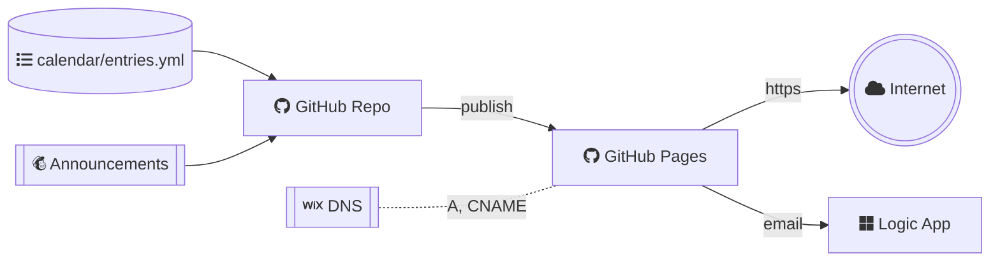

# churchincanberra.org website

[](https://github.com/churchincanberra/churchincanberra.github.io/actions/workflows/github-code-scanning/codeql)
[](https://github.com/churchincanberra/churchincanberra.github.io/actions/workflows/jekyll.yml)
[](https://github.com/churchincanberra/churchincanberra.github.io/actions/workflows/update-announcement.yml)

This repository hosts the website on GitHub Pages. The Church in Canberra is a non-profit organisation located in Canberra, Australia.

<details><summary>:globe_with_meridians: How does this website work?</summary>


</details>

### How-To's: Website maintenance

<details><summary>1. How to update the church calendar</summary>

All event entries are stored in `_data/calendar/entries.yml`. Add or update entry as applicable.

Example entry:

```
- id: "a"
  name: "Eternal Future"
  description: "New Heaven and New Earth."
  category: "national"
  singular: false
  date: "0000-01-01"
  location: "New Jerusalem"
```

If an event is marked singular, it only appears in the year it is created for. If it is not singular, it appears in each year.

**Note:** If multiple events are created for the same month and day, use unique `id`s! `id` can be alphanumeric but needs to start with alphabet

For each unique category, a category entry must be created in `_data/calendar/categories.yml`. The category id must match the id used by the entries. The color tag is utilized to color the calendar entries of the corresponding category.

```
- id: national
  name: National
  color: "#0000ee"
```

This allows calendar entries to be filtered by category.

</details>

<details><summary>2. How to update the church announcement</summary>

Church announcement page is updated automatically by `update-announcement.yml`. The update is scheduled to run twice every Sunday at 09:30 AEST and 09:30 AEDT.

At high level, the automation works as follows:

1. Call the MailChimp archive URL to retrieve the latest campaign URL.
1. Retrieve the content from the campaign URL.
1. Filter the content and prepare for publishing.
1. Commit new announcement content if there is any change.

</details>

<details><summary>3. How to update the contact form's recipients</summary>

The contact form is powered by [Contact Me workflow app](https://github.com/churchincanberra/azure-logicapps/). The recipient email address is configured at `EMAIL_RECIPIENTS` under Settings | Security | Repository Variables.

</details>

## How to contribute

Contributions are welcome! Read the following sections to get started.

<details><summary>:gear: Getting started</summary>

Follow the [Jekyll docs](https://jekyllrb.com/docs/installation/) if setting up Jekyll for the first time.

Download or clone the repository.

To run the site locally, navigate to the repository directory and run:

```bash copy
bundle install
```

To start the Jekyll local development server.

```bash copy
bundle exec jekyll serve
```

To build the site.

```bash copy
bundle exec jekyll build
```

</details>

<details><summary>:repeat: Workflow</summary>

This website maintains by [GitHub flow](https://docs.github.com/en/get-started/quickstart/github-flow). At high level,

1. Fork and clone the repository to your local environment.
1. Make and commit your changes with a clear and concise [conventional commit](https://www.conventionalcommits.org/) message.
1. Open a pull request in your forked repository, tell me about your idea and changes.
1. Respond to any feedback from the maintainers.
1. Make any necessary changes from the feedback.
1. Once approved and all required checks passed, merge your pull request and your changes will be deployed to the `gh-pages` production environment.

</details>

**Note:** When deploying, assure `baseurl` value in the `_config.yml` otherwise all the css, images and paths will be broken.

For example the site https://hosting.com/churchincanberra would have `baseurl: "/churchincanberra/"`

## Credits

This website is licensed under the terms of the [MIT license](LICENSE). We would like to thank the following open source projects for their contributions.

<details><summary><strong>1. Key components</strong></summary>

- Jekyll 4.2+
- Bootstrap 4.6
  - Services (Collection)
  - Teams (Collection)
  - SCSS
- [gems/jekyll-environment-variables](https://rubygems.org/gems/jekyll-environment-variables/)
- [gems/jekyll-seo-tag](https://rubygems.org/gems/jekyll-seo-tag)

</details>

<details><summary>2. Other projects</summary>

- [Jekyll Serif theme](https://github.com/zerostaticthemes/jekyll-serif-theme)
- [Password protected for static pages](https://github.com/matteobrusa/Password-protection-for-static-pages)
- [Calendar component](https://github.com/abzicht/jekyll-calendar)
- [HTTP Request Superagent](https://github.com/ladjs/superagent)
- [Blog post workflow](https://github.com/gautamkrishnar/blog-post-workflow)

</details>

